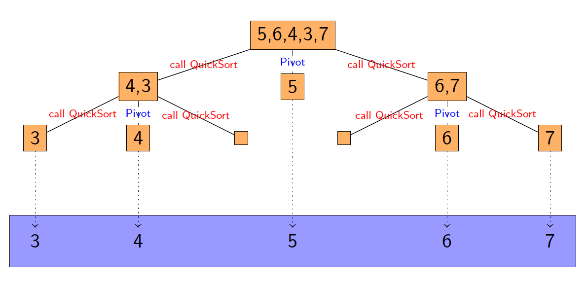

# Divide and Conquer Algorithms

## Definition

>Divide and conquer is based on the idea that a problem can be solved by splitting it into smaller subproblems, solving them, and then composing the solutions to the subproblems into a solution for the whole problem.

## Requirements

1. A way of splitting the problem into substantially smaller subproblems.
2. A way to solve small instances of the problem.
3. A way to recombine the solutions of the small problem into the solution of the larger problem

## Example: Searching

- Let `T[1:n]` be an array sorted into increasing order: that is if $1\le i \lt j \le n$ holds, then $T[i] \le T[j]$
- Finding `x` in the array `T`if indeed it is there
- If not, return the position for insertion: finding an index `i` such that $0 \le i \le n$ and $T[i] \le x \lt T[i+1]$

## Binary Search

``` pseudocode
BinSearch(T[i:j], x) RETURNS ARRAY OF REAL
	IF i=j
		RETURN i //base case
		k = [(i+j+1) div 2] 
		IF x < T[k] THEN
			RETURN BinSearch(T[i:k-1],x)
		ELSE
			RETURN BinSearch(T[k:j],x)
  	
```

## Merge Sort

- ***Divide*** - divide the n-element sequence to be sorted into two suybsequences of $\frac{n}{2}$ elements each

- ***Conquer*** - sort the two subsequences recursively using `MergeSort(Array -> Array)`
- ***Combine*** - merge the two sorted subsequences to produce the sorted answer

```pseudocode
FUNCTION MergeSort(A[i:j]) RETURNS ARRAY OF REAL
	IF i=j THEN
		RETURN A[i:j]
	ELSE
		u = MergeSort(A[i:j/2])
		v = MergeSort(A[j/2 + 1:j])
		RETURN Merge(u,v)
	
```

### Improving the algorithm

Because Merge Sort does not perform so well when the number of elements is small, so it might be better to substitute the base case with Insertion Sort

``` pseudocode
FUNCTION MergeSort(A[i:j]) RETURNS ARRAY OF REAL
	IF j-i is small
		RETURN InsertionSort(A[i:j])
	ELSE
		u = MergeSort(A[i:j/2])
		v = MergeSort(A[j/2+1:j])
		RETURN Merge(u,v)
```

## Quick Sort

QuickSort is also based on the divide and conquer approach. The key features of the algorithm are the following, where `A[p:r]` denotes a subarray (that could be the input array).

- ***Divide*** - The array `A[p:r]` is partitioned (rearranged) into two non-empty subarrays `A[p:q]` and `A[q+1:r]` such that each element of `A[p:q]` is less than or equal to each element of `A[q+1:r]`. The index q is computed as part of this partitioning procedure.

- ***Conquer*** - The two subarrays `A[p:q]` and `A[q+1:r]` are sorted by recursive calls to QuickSort.

- ***Combine*** - Since the subarrays are sorted in place, no work is

  need to combine them: the entire array `A[p:r]` is now sorted.

### Problem

The decomposition is possible to be highly unbalanced.

For efficiency, assume the array is external to the pseudocode. So the code manipulates this external array. The only information being passed with each function call are the pointers. This assumption means that copies of the array do not have to be made.

### Pseudocode

```pseudocode
// T is a global variable
FUNCTION Pivot(T[i:j]) RETURNS INT
	p = T[i]
	k = i
	l = j + 1
	REPEAT 
		k = k + 1 
	UNTIL T[k] > p OR k >= j
	REPEAT 
		l = l - 1 
	UNTIL T[l] <= p
	WHILE k < l
		Swap(T[k], T[l])
		REPEAT 
			k = k + 1 
		UNTIL T[k] > p
		REPEAT 
			l = l - 1 
		UNTIL T[l] <= p
	Swap(T[i], T[l])
	return l
	
PROCEDURE QuickSort(T[i:j])
	IF i < j THEN
		l = Pivot(T[i:j])
		QuickSort(T[i:l-1])
		QuickSort(T[l+1:j])
```

***Note that*** -  the `pivot` procedure here, and in the following slides, involves a more complex method for re-insertion at the end of the array.

### Python Code

```python
class quicksort:
    def __init__(self):
        self.T =  [3,4,2,5,1,6,9,8,0,7]
        self.i = 0
        self.j = len(self.T) - 1

    def swap(self,x,y):
        temp = self.T[x]
        self.T[x] = self.T[y]
        self.T[y] = temp

    def pivot(self,i,j):
        p = self.T[i]
        k = i
        l = j
        while self.T[k] <= p and k<j:
            k += 1
            print(k)
        while self.T[l] >p:
            l -= 1
        while k<l:
            self.swap(k,l)
            while self.T[k] <= p:
                k += 1
            while self.T[l] > p:
                l -=1
        self.swap(i,l)
        return l

    def sort(self,i,j):
        if i<j:
            l = self.pivot(i,j)
            self.sort(i,l-1)
            self.sort(l+1,j)

a = quicksort()
a.sort(a.i,a.j)
print(a.T)
```

### Conlusion

- The worst case running time is $n^2$ for an input $n$.

- However, it is often the best practical choice for sorting because on average it has a running time of $n \log n$, and the average case can be shown to hold with a ***high probability***.
- Furthermore, the hidden constant is in practice smaller than that in `MergeSort`.