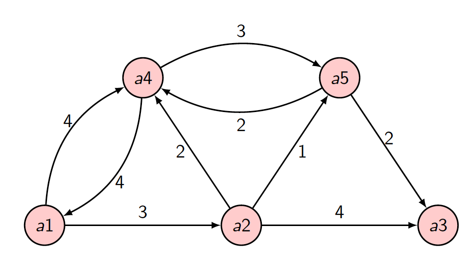
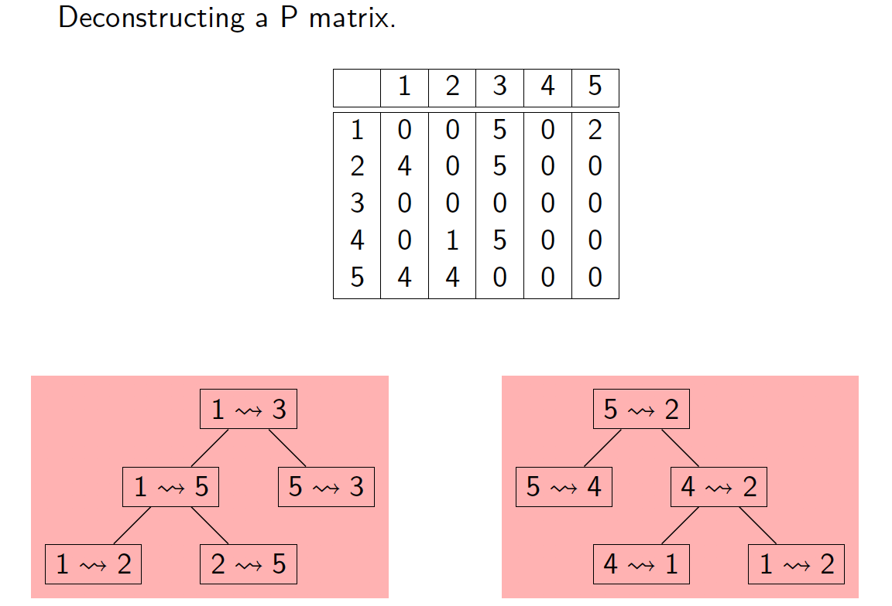

# Dynamic Programming

## Introduction

- Dynamic programming typically applies to optimisation problems in which a set of choices must be made in order to arrive at an optimal solution.

- As choices are made, subproblems of the ***same*** form often arise.

- Dynamic programming is effctive when a given subproblem may arise from more than one partial set of choices; the key technique is ***to store, or memorize, the solution to each subproblem in case it should reappear***.

- This idea can transform some ***exponential*** time algorithms into ***polynomial*** time algorithms.

- Dynamic programming, like divide and conquer, solves problems by ***combining*** the solutions to subproblems.

- Dynamic programming is applicable when the subproblems are ***not independent*** - in other words, when subproblems share sub-subproblems.
- In this context, a divide and conquer algorithm does more work than is necessary - since it repeatedly solves common subproblems.

##  Approach

Dynamic programming is a "bottom-up" approach

- ***Start*** - with smallest subinstances
- ***Combine*** - solutions to subinstances to get larger problems
- ***Until*** - solution to original problem is obtained

By contrast, divide and conquer is a top-down method solving a problem by diving into subproblems.

Dynamic programming, like the greedy approach, applies to optimisation problems where a set of choices is made to derive an optimal solution.

- Greedy choice is local

- Dynamic programming choice is global

## Optimal Substructure

> A problem has optimal subsructure if an optimal solution to the problem contains optimal solutions to subproblems

### Example: Manchester to London

If Birmingham is known to be on the shortest route from Manchester to London, then the shortest route from Manchester to Birmingham and the shortest route from Birmingham to London can be composed to give the solution for the shortest route from Manchester to London.

Yet, even if Birmingham is known to be on the fastest route from Manchester to London, the fastest route from Manchester to Birmingham and the fastest route from Birmingham to London cannot necessarily be composed to give the fastest route from Manchester to London.

For instance, the fastest journey from Manchester to Birmingham may use so much fuel that a fuel stop is required to be able to continue to London. Cars use more fuel at high speed. So may be better to go slower from Manchester to Birmingham to avoid the fuel stop.

### Example: Calculating Binomial Coefficients

> The number of ways of picking k items for n items
> $$
> \binom{n}{k} = \frac{n!}{(n-k)!k!}
> $$

Recursive definition of binomial coefficient:
$$
\binom{n}{k} = \begin{cases}\binom{(n-1)}{(k-1)}+\binom{(n-1)}{k},o\lt k \lt n\\1\space otherwise\end{cases}
$$

#### Pseudocode

```pseudocode
FUNCTION BC(n,k) RETURNS INT
	IF k = 0 OR k = n THEN
		RETURN 1
	ELSE
		RETURN BC(n-1,k-1) + BC(n-1,k)*
```

***Problem***: recalculation of many values. 

***Solution***: To improve efficiency, use a dynamic programming approach that stores intermediate values. We can use a vector of size $k$ and  it takes time in the order of $nk$.

| $n$\ $k$ | 0    | 1    | 2    | ...  | $k-1$          | $k$          |
| -------- | ---- | ---- | ---- | ---- | -------------- | ------------ |
| 0        | 1    |      |      |      |                |              |
| 1        | 1    | 1    |      |      |                |              |
| 2        | 1    | 2    | 1    |      |                |              |
| ...      |      |      |      | ...  |                |              |
| $n-1$    |      |      |      |      | $BC(n-1, k-1)$ | $BC(n-1, k)$ |
| $n$      |      |      |      |      |                | $BC(n,k)$    |

## Floyd's Algorithm

-   Calculate the length (*cost, weight*) of a shortest path between each pair of nodes.

-   C.f. Cost of shortest path from a designated node (Dijkstra's Algorithm)

-   For Floyd's Algorithm, assume problem has optimal substructure
  
    -   if $j$ is on a shortest phath from $i$ to $k$, then a shortest path from $i$ to $j$ and a shortest path from $j$ to $k$ can be composed for a shortest path from $i$ to $k$
    
-   Variants of Floyd's algorithm include FloydPath algorithm and Warshall's algorithm

    ### Input

    Input is a directed weighted graph represented by an adjacency matrix $L = M\times N$

    -   $L[i,j] = 0$
    -   $L[i,j] = w$, where $w$ is the weight (cost, distance) of arc $(i,j)$
    -   $L[i,j = \infty$  if no arc $(i,j)$



### Output

Output is the matrix $D$ which gives the cost of the shortest path between each pair of nodes.

-   **Start** - with $D=L$
-   ***Interim*** - after $k$ iterations of the algorithm, $D$ gives the length of the shortest apaths that only use nodes  $\{ 1,\dots , k \}$ as intermediate nodes
-   ***End***  - after $n$ iterations *(where $n$ is the number of nodes in the graph)*

###  Pseudocode

```pseudocode
FUNCTION Floyd(L[1,...,n,1,...,n]) RETURNS ARRAY OF ARRAY OF INT
	D = L
	FOR k = 1 TO n //mid point
		FOR i = 1 TO n // start point
			FOR j = 1 TO n // end point
				D[i][j] = min (D[i][j] , D[i][k] + D[k][j])
				
	RETURN D
```

## FloydPath Algorithm

An amended algorithm from Floyd which returns the routes also. A second matrix `P` will give an intermediate node on the route from $i$ to $k$, we can then recover the complete path by tracing it back

### Pseudocode

```pseudocode
FUNCTION FloydPath(L[1,...,n,1,...,n]) RETURNS ARRAY OF ARRAY OF INT
	D = L
	set P to 0
	FOR k = 1 TO n
		FOR i = 1 TO n
			FOR j = 1 TO n
				IF  D[i][k] + D[k][j] < D[i][j] THEN
					D[i][j] = D[i][k] + D[k][j]
					P[i][j] = k // k is the intermediate node from i to j
	RETURN D, P
				
```



## Warshall's Algorithm

An algorithm designed to find the existency of paths in a directed graph, with no illustration on the cost of each path. So it is not an optimisation algorithm.

-   The adjacency matrix uses Boolean values
    -   $L[i,j] = True$ if there is an arc $(i,j)$
    -   $L[i,j] = False$ otherwise
-   Output matrix $D$ uses Boolean values for path existence
    -   $D[i,j] = True$ if there is a path from $i$ to $j$
    -   $D[i,j] = False$ otherwise
-   The output represents the transitive closure of the graph

Warshall's algorithm is a slight modication of Floyd's algorithm. The original adjacency matrix is set-up as having Boolean variable instead of numerical values.

### Pseudocode

```pseudocode
FUNCTION Warshall(L[1,...,n,1,...,n]) RETURNS ARRAY OF ARRAY OF INT
	D = L
	FOR j = 1 TO n
		FOR i = 1 TO n
			IF i <> j and D[i][j] = True THEN
				FOR k = 1 TO n
                	D[i][k] = D[i][k] OR D[j][k]
```

