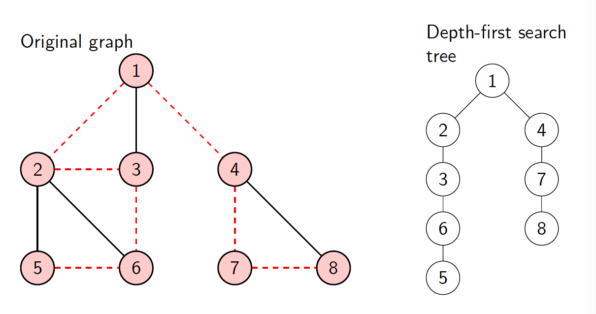
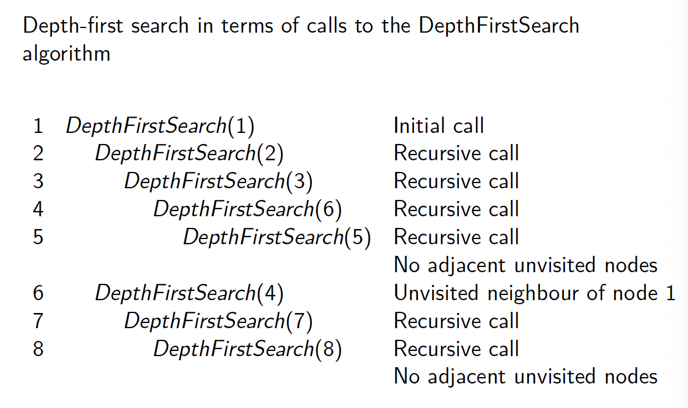
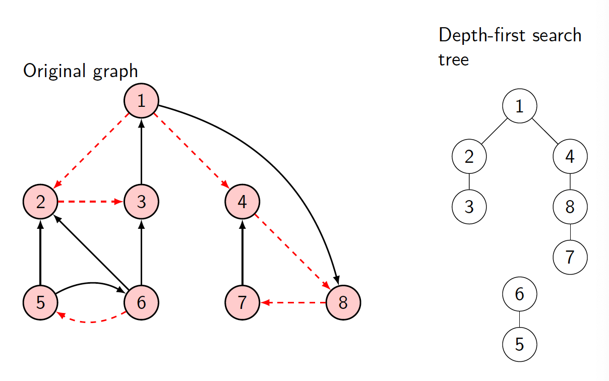
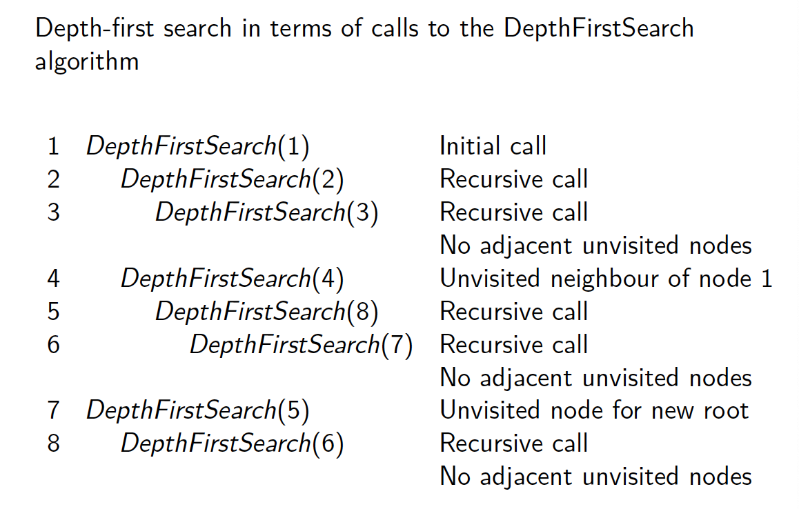
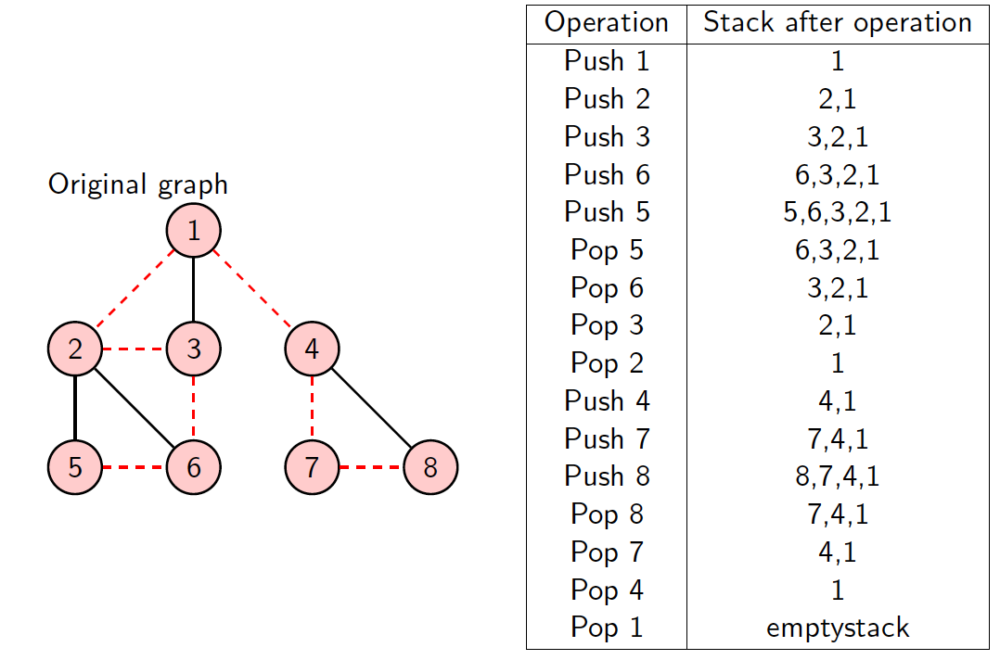
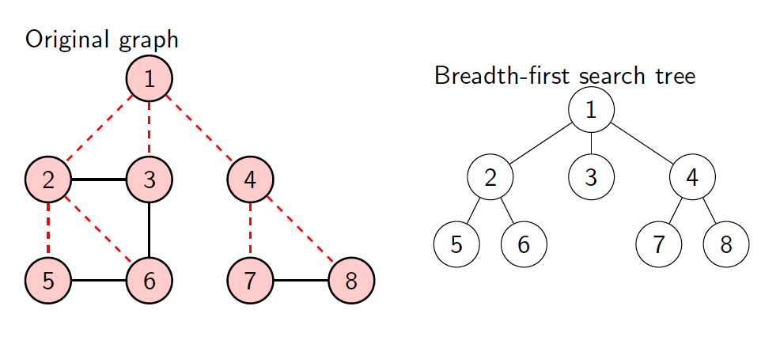
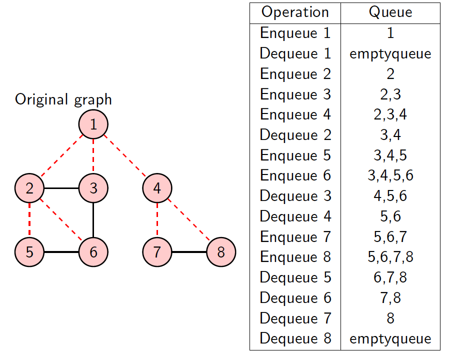

# Graph Traversal

## Definition

Methods to visit all nodes in a graph.

-   Depth-first Search
-   Breadth-first Search

Each search produces a spanning tree: the nodes of the tree are the nodes of the graph, and the arcs are a subset of the arc of the graph

## Depth-first Search

Pick an arbitrary node $v$, and start the process there:

1.  we visit it

     		2. then if there is an adjacent unvisited node
     		3. we start the process again at the adjacent node
     		4. we continue recursively, until we visit a node and there are no unvisited adjacent nodes. - *this means that this call of `DepthFirstSearch` has been satisfied, and control moves back to the previous call of `DepthFirstSearch` where the process continues*
     		5. Eventually all the nodes adjacent to $v$ will be visited
     		6. If the remain any other nodes in $G$ unvisited, arbitrarily pick one of the unvisied nodes, and start the process at this new node
     		7. Continue until no unvisited nodes remain

### Pseudocode

```pseudocode
FUNCTION Search(G)
	FOR v in N
		mark[v] = notVisited // set up an array called mark
	FOR v in N // arbitrarily pick
		IF mark[v] <> Visited THEN 
			DepthFirstSearch(v)

FUNCTION DepthFirstSearch(v)
	mark[v] = visted
	FOR w in nodes adjacent to v
		IF mark[w] <> Visited
			DepthFirstSearch(w)
```

### Example 1





### Example 2: Directed Graph





## Comparing Depth-First Search and Breadth-First Search

To compare, we consider a ***non-recursive*** formulation of depth-first search

### Pseudocode

```pseudocode
PROCEDURE DepthFirstSearch2(v)
	P = emptyStack
	mark[v] = visited
	push v on P
	WHILE P <> Null
		WHILE there is a node w adjacent to top(P) //mark[w] <> visited
			mark[w] = visited
			push w on P
		pop top(P)
			
PROCEDURE Search2(G)
	FOR each v IN N
		mark[v] = not-visited
	FOR each v IN N
		IF mark[v] <> visited
			DepthFirstSearch2(v)
```



## Breadth-First Search



### Pseudocode

```pseudocode
PROCEDURE BreadthFirstSearch(v)
	Q = emptyQueue
	mark[v] = visited
	enqueue v into Q
	WHILE Q <> NULL
		u = first(Q)
		dequeue u from Q
		FOR each node w adjacent to u
			IF mark[w] <> visited
				mark[w] = visited
				enqueue w into Q

PROCEDURE Search3(G)
	FOR v IN N
		mark[v] = not-visited
	FOR v IN N
		IF mark[v] <> visited
			BreadthFirstSearch(v)
```

