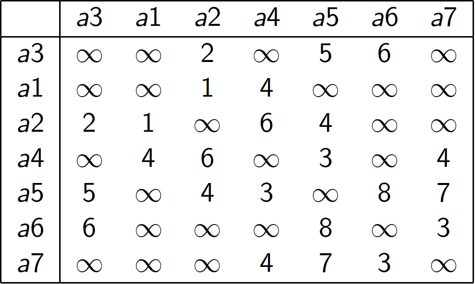
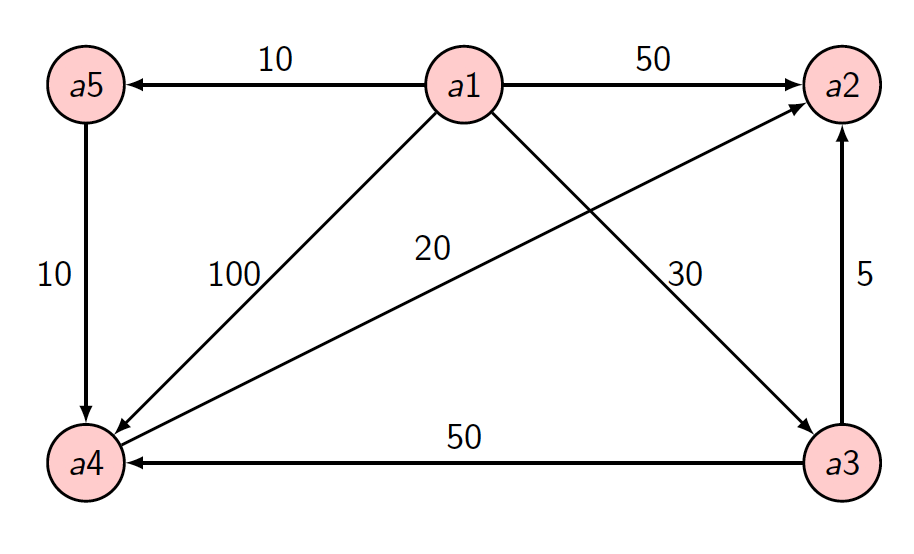
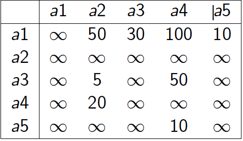
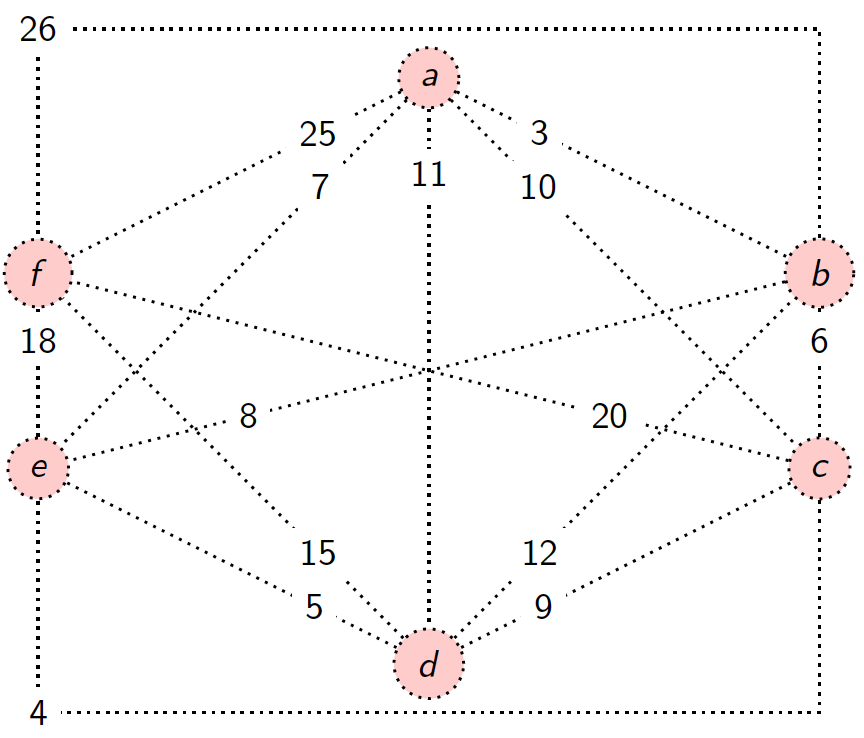
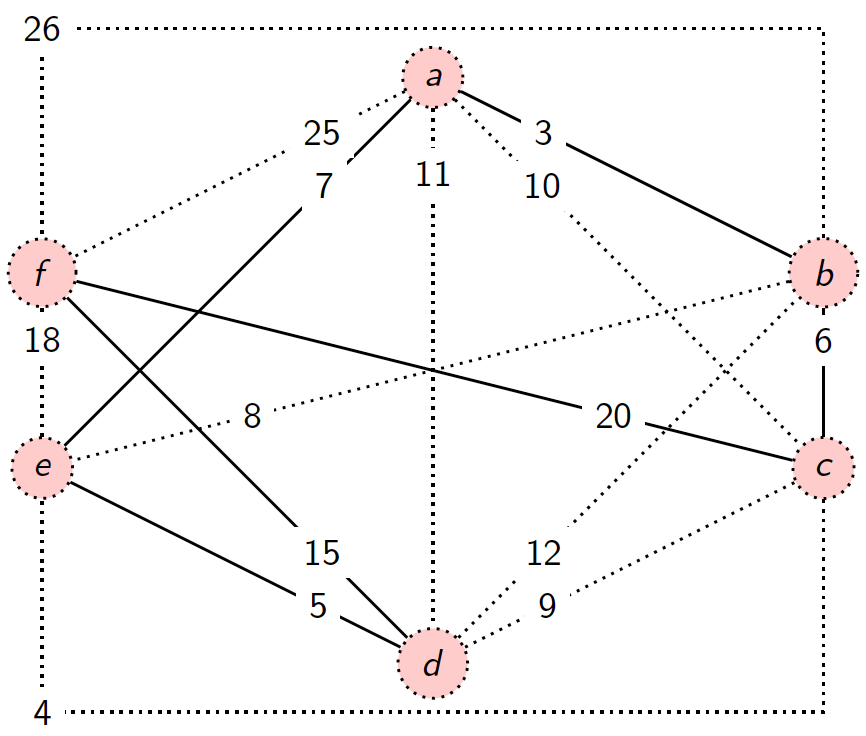

# Greedy Algorithms

## Features

- Often simple
- Often used for optimisation problems (e.g. shortest path of a graph)
- Solution is constructed incrementally (built-up solution, no going back - efficient)
  - At each stage, next part of the solution is added
  - At no stage is backtracking done
- Not guaranteed to succeed on all problems, though is guaranteed on some problems (e.g. finding short path in a graph)
- Greedy algorithms offers locally optimum strategy
- Suggesting next best move at each stage

## Application

- Job scheduling
- Giving change
- Finding shortest route in a network
- Find codes for text compreesion
- etc

## Example: customer queues

> Select the customer with the shortest task, and then the customer with the next shortest task, and so on

## Example: Giving change

>To give change for $X$, we use the largest denomination possible. If the largetst coin is $Y$, we then need to give change for $X-Y$ and apply greedy strategy again

Greedy strategy works for decimal coinage with 1,2,5,10,20 and 50

Doesn't work for different coin set e.g. 10, 9,1. In order to give 27, greedy algorithms give 10,10,1,1,1,1,1,1,1 instead of 9,9,9

## Example: Finding minimum spanning trees

Let $G = (N.A)$ be a connected undirected graph, where $N$ is the set of nodes and $A$ is the set of edges

A ***minimum spanning trees*** is a data structure in $G$ that connects ***all*** nodes with the shortest edges. ***Spanning*** means it connects all the nodes in such a graph.

## Kruskal's Algorithm

A greedy algorithm for finding a minimum spanning tree

Input: an undirected weighted graph

Solution is constructed incrementally:

1. At start, $T= \emptyset$

 	2. With each step, an arc is added to $T$ to created connected subgraphs without causing a cycle
 	3. Finished with $n-1$ arcs in $T$

Let $G = (N,A)$ be a graph, and `(Cost : Natural -> Real)`, `SetUpComponents(N)`creates the components (each nodes is in a singleton set). `Find(x)` gives the componexnt that includes `x`, `Merge(x,y)` merges the disjoint sets `Find(x)` and `Find(y)`

```pseudocode
FUNCTION Kruskal(N,A,Cost)
	T = Null
	n = |N|
	SetUpComponents(N)
	REPEAT
		// (u,v) is the shortest edge not yet considered
		ucomp = Find(u)
		vcomp = Find(v)
		IF ucomp <> vcomp
			Merge(ucomp,vcomp)
			T = T.Union{(u,v)}
	UNTIL |T| = n-1
	RETURN T
```

## Prim's Algorithms

- A greedy algorithm for finding a minimum spanning tree.
- Input is the undirected weighted graph
- At each step, there is only a single tree being built (c.f. Kruskal's algorithm).
  - Initially, the set B contains a single node, and the set of arcs T is empty.
  - At each step, the cheapest arc is selected that links the current tree with a node outside the tree.

Let `G=(N,A)`be a graph, and `Cost` be a function that assigns a real number to each arc (to denote cost, length, time, etc depending on the application). 

### Pseudocode for High-Level Algorithm

```pseudocode
FUNCTION Prim(N,A,Cost)
	T = Null
	B = {x} //where x is an arbitrary member of N
	WHILE B <> N
		//find(u,v) of minimum cost such that u in N-B and v in B
		T = T.Union{(u,v)}
		B = B.Union{u}
	RETURN T
```

For a more detailed version of Prim's algorithm, we require the

following arrays.

- For $i \in  N- B$, `Nearest[i]` is an array that gives the nearest node for `i` in `B`
- For $i \in  N- B$, `MinDist[i}` is an array that gives the distance from `i` to`Nearest[i]`.
- For $i \in B$, `MinDist[i] = -1`

The nodes of the graph are numbered 1 to n and a symmetric matrix $L$ gives the cost of each arc, with $L[i , j ] = \infty$  is the arc between `i` and `j` does not exist.



### Pseudocode for Lower-Level Algorithm

```pseudocode
FUNCTION Prim(L,[1,...,n,1,...,n])
	T = Null
	// initialisation
	FOR i = 2 TO n
		Nearest[i] = 1
		MinDist[i] = L[i,1]
	// find next node
	REPEAT n-1 times
		min = 1000 //infinity
		FOR j = 2 TO n
			IF 0 <= MinDist[j] <= min THEN
				// update the value of min to find the edge of a node with the lowest cost
				min = MinDist[j]
				k = j
		// add arc to tree
		T = T.Union{(k,Nearest[k])} 
		// now ignore
		MinDist[k] = -1
		// update MinDist and Nearest because a node is added to the T
		// now consider the next node with the lowest cost from the point of view of the recently added node
		FOR j = 2 TO n 
			IF L[k,j] < MinDist[j] THEN
				MinDist[j] = L[k,j]
				Nearest[j] = k
	RETURN T
					
```

### Python Code

```python
inf = float('Inf')


def Prim(L = []):
    T = []
    Nearest = []
    MinDist = []
    n = len(L)
    #print("n = "+str(n))
    for i in range(0,n):
        Nearest.append(0)
        MinDist.append(L[0][i])
    print("\tInitial Nearest = "+str(Nearest))
    print("\tInitial MindDist = "+str(MinDist))
    x = 1
    while x < n:
        print("\n\tCycle = " + str(x))
        minval = inf
        for j in range(1,n):
            #print(str(j))
            if 0 <= MinDist[j] and MinDist[j] <= minval:
                minval = MinDist[j]
                k = j
        print("\tNode added to solution = "+str(k))
        print("\tArc added to solution = "+str([k,Nearest[k]]))
        T.append([k,Nearest[k]])
        MinDist[k] = -1
        for j in range(1,n):
            if L[k][j] < MinDist[j]:
                MinDist[j] = L[k][j]
                Nearest[j] = k
        print("\tMinDist = "+str(MinDist))
        print("\tNearest = "+str(Nearest))
        x = x+1
    return T

#L = [[inf, 4, inf],[4, inf, 5],[inf, 5, inf]]

L = [[inf,inf,2,inf,5,6,inf],
     [inf,inf,1,4,inf,inf,inf],
     [2,1,inf,6,4,inf,inf],
     [inf,4,6,inf,3,inf,4],
     [5,inf,4,3,inf,8,7],
     [6,inf,inf,inf,8,inf,3],
     [inf,inf,inf,4,7,3,inf]]


print("The adjacency matrix is \n")

for row in L:
    print("\t"+str(row))

print("\n")

tree = Prim(L)

print("\nFinal tree has the following arcs \n")

for arc in tree:
    print("\t"+str(arc))

print("\n\n")
```

## Dijkstra's Algorithm

- Input is a weighted directed graph and a designated node.
- Output is ***the cost of the shortest path*** from the designated node to each of the other nodes
- Solution is constructed ***incrementally***
  - At start, S is the emptyset
  - At each step, a node x is added to S whose distance from designated node is least.
  - At end, S contains all the nodes.



### Adjacencies Matrix

The nodes of the graph are numbered $1$ to $n$ and a matrix $L$ gives the cost of each arc, with $L[i , j ] = \infty$ is the arc between $i$ and $j$ does not exist.



- A path is special if all intermediate nodes along the path belong to partial solution `S`
- An array `D` contains the cost of the shortest special path to each node from the source (i.e. the designated node).
- When extend `S` by a new node, update `D` if path via the new node is shorter.

### Pseudocode

```pseudocode
FUNCTION Dijkstra(L[1,...n,1,...n])
	C = {2,3,...,n}
	FOR i = 2 TO n
		D[i] = L[1,i]
	REPEAT n-2 times
		v = some element of C minimising D[v]
		C = C-{v}
		FOR w in C
			// comparing wether D[w] or D[v]+L[v,w] has smaller cost
			D[w] = min(D[w], D[v]+L[v,w])
	RETURN D
```

### Python Code

```python
inf = float('Inf')
L = [[inf,50,30,100,10],
     [inf,inf,inf,inf,inf],
     [inf,5,inf,50,inf],
     [inf,20,inf,inf,inf],
     [inf,inf,inf,10,inf]]

def find_v(D = [],c = []):
    min = D[0]
    for i in c:
        index = int(i.replace('a',''))-2
        #print('Index:',index)
        if min>D[index]:
            min = D[index]
            v = index
    return v

def dijkstra(L = []):
    c = []
    D = []
    n = len(L)
    for i in range(1, n):
        c.append("a"+str(i+1))
        D.append(L[0][i])
    print('Initialisation')
    print('c:',c)
    print('D:',D)
    x=1
    while x < n-1:
        print('=========\nCycle:', x)
        v = find_v(D,c)
        print('a' + str(v + 2))
        c.remove('a'+str(v+2))
        print(c)


        for w in c:
            w = int(w.replace('a',''))-2
            #print('w:',w)
            #print('sum:',(D[v]+L[v+1][w]))
            #print('D[w]:',D[w])
            D[w] = min(D[w],(D[v]+L[v+1][w+1]))

        print('D:',D)
        x+=1
    return D

print(dijkstra(L))
```


## The Limitations

Many problems exist for which there is no greedy algorithm that provides an optimal solution. For example, ***travelling salesperson problem***

> A salesperson travelling all the cities, a part from the starting points, no more than once. Find the path with the lowest cost.



### Greedy Algorithm Solution

Take the shortest edge available with two constraints:

1. It must not form a cycle with the edges already chosen, apart from the very last edge

2. If chosen this new edge must not be the third edge involving either node dening this edge. This means we must not revisit a node | each node will have an *"incoming"* edge to arrive at the city and an *"outgoing"* edge to leave the city.

### Cheapest Route

